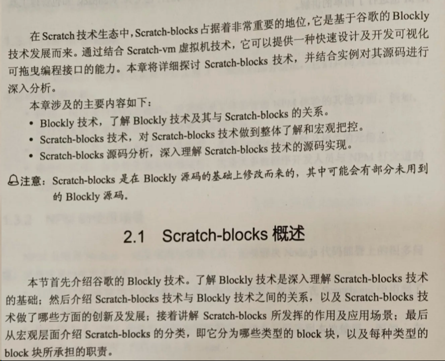

# 📚 《Scratch 底层架构源码分析》

# 🤖 AI

## 🤖 请问 scratch-blocks 是什么？【通义千问 2.5】

`scratch-blocks` 是一个由麻省理工学院（MIT）的 Scratch 团队开发的开源库，它基于 Google 的 Blockly 项目。这个库主要用于构建创意计算接口，特别是为 Scratch 编程环境提供图形化编程块的支持。`scratch-blocks` 与 Scratch 虚拟机（VM）结合使用时，可以快速设计和开发高度动态的交互式编程体验。

以下是 `scratch-blocks` 的一些关键特性：

1. **图形化编程界面**：允许用户通过拖放积木来创建程序，这使得编程对于儿童和初学者来说更加直观和易于理解。
2. **自定义功能**：虽然从 Blockly 分支而来，但 `scratch-blocks` 包含了许多自定义的功能，这些功能是专门为 Scratch 环境设计的。
3. **不依赖代码生成器**：不同于 Blockly 使用代码生成器将积木转换为文本代码，`scratch-blocks` 利用 Scratch 虚拟机直接执行积木，从而实现更直观的编程环境。
4. **跨平台支持**：可以在多种平台上运行，包括桌面浏览器和移动设备，这有助于 Scratch 在不同环境中提供一致的用户体验。
5. **社区支持**：拥有活跃的开发者社区，持续更新和改进，以适应新的技术和教育需求。
6. **可扩展性**：开发者可以通过添加新的积木或修改现有积木来扩展其功能，使其能够适应不同的教学场景和应用程序。

`scratch-blocks` 主要用于 Scratch 3.0 及更高版本中，它是 Scratch 编程语言的核心组成部分之一。如果你想要深入了解或贡献于 `scratch-blocks` 项目，可以访问它的 GitHub 仓库获取更多详细信息和文档。

## 🤖 请问 scratch-blocks 是什么？【通义千问 2.5 深度搜索】

`scratch-blocks` 是一个开源库，它为 Scratch 编程环境提供图形化编程界面的支持。这个项目是从 Google 的 Blockly 项目中衍生出来的，专门用于构建富有创意的计算接口。以下是 `scratch-blocks` 的一些关键点：

### 定义
- **基于 Blockly**：`scratch-blocks` 是基于 Google 的 Blockly 项目的一个分支，Blockly 是一个广泛使用的工具，它允许用户通过拖拽积木来创建程序。
- **专为 Scratch 设计**：虽然继承自 Blockly，但 `scratch-blocks` 包含了许多特定于 Scratch 的功能和设计元素，以适应 Scratch 的教育目标和用户体验需求。

### 特点
- **直观易学**：颜色编码的积木块对应不同类型的指令，这使得视觉效果友好且易于理解，适合初学者特别是儿童学习编程。
- **兼容性广**：支持多种编程语言，并且能够适应不同水平和需求的用户。
- **开放源码**：鼓励社区贡献和改进，确保项目的持续发展和创新。
- **跨平台**：可以在任何现代浏览器上无缝运行，不受设备限制，这增强了其可用性和普及度。

### 应用
- **教育领域**：作为可视化工具帮助学生理解控制流、变量以及其他基本编程概念，非常适合在课堂上教授编程基础知识。
- **游戏开发**：用户可以利用这些积木块来创建游戏逻辑和交互。
- **扩展其他软件**：开发者可以使用 `scratch-blocks` 创建新的积木块，从而扩展其他编程平台或工具的功能。

### 开发者资源
- **文档与代码**：提供了详细的文档和代码示例，方便开发者进行二次开发和定制。例如，如何定义新的积木块，以及如何修改现有的积木块行为。
- **二次开发**：对于想要对 Scratch 进行更深入定制的开发者，`scratch-blocks` 提供了丰富的 API 和方法，如 `blockToCode` 方法可以将图形化的积木转换成具体的编程语言代码。
- **生态项目**：基于 `scratch-blocks` 构建的一些典型项目展示了该库的强大功能和灵活性，包括教育应用、游戏开发等。

总之，`scratch-blocks` 不仅是 Scratch 编程环境中的一个重要组成部分，也为那些希望创造自己的可视化编程工具的开发者提供了一个强大的框架。它结合了教育性和可玩性，使得编程成为一种更加吸引人且易于掌握的活动。