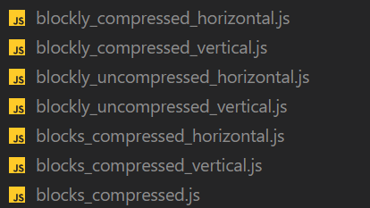
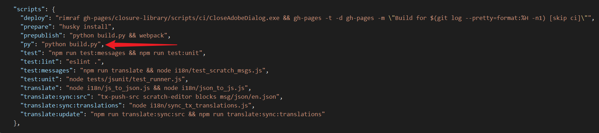
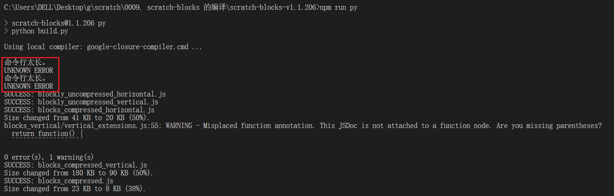
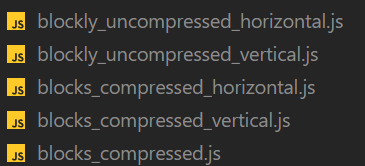
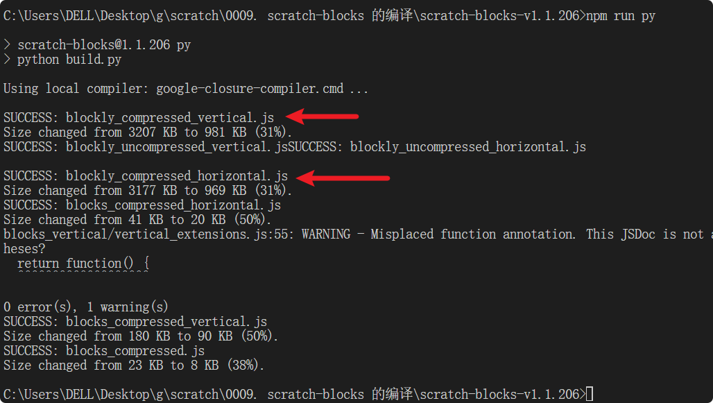
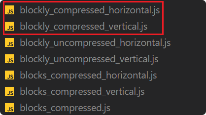

# 🔗 链接

scratch-blocks -- wiki -- Building

https://github.com/scratchfoundation/scratch-blocks/wiki#building

相关工具及对应版本：


# 💻 编译流程

正常情况下，当我们执行 `npm i` 的时候，在安装依赖的同时，就会完成编译，并在项目根目录生成以下编译产物。



```bash
$ npm i
# 只需要安装依赖，就会自动完成编译，编译命令封装的 package.json 中的 scripts 字段中的 prepublish 钩子中。
# 在执行 npm i 的过程中，prepublish 这个 npm 钩子会自动运行。
# 执行 npm run prepublish 这条命令的时候，实际上执行的命令是：python build.py && webpack
```

# ❌ 【坑】Windows 环境下的命令行太长错误

如果是 macOS 环境，会发现可以正常完成编译，但是在 Windows 环境下编译的话，可能会在在运行 build.py 的过程中抛出如下错误：（为了方便查看，可以单独将 python build.py 命令抽离为一个 scripts 脚本）

在 [package.json](./scratch-blocks-v1.1.206/package.json) 中加上 `"py": "python build.py",` 命令。



在终端执行 `npm run py`，会发现有两个文件在生成时报错了，提示命令行太长。



导致编译产物中只生成了这些文件：



通过查看 [build.py](./scratch-blocks-v1.1.206/build.py) 中的脚本，会发现生成失败的两个文件分别是：`blockly_compressed_vertical.js`、`blockly_compressed_horizontal.js`。而 `blockly_compressed_vertical.js` 模块，就是当前项目 scratch-blocks 向外暴露的依赖入口，它生成失败，意味着我们在 core 中做的修改，在重新编译后，外界依旧是访问不到的，因为在引用 scratch-blocks 的时候找不到入口。

提供一种解决思路：**将命令行参数写入到一个文件中，通过文件路径的形式来访问，以免将参数拼接到命令行中，导致命令行过长的报错。**

具体做法，修改 build.py 中的 do_compile_local 方法。

```py
# 修改之前
  def do_compile_local(self, params, target_filename):
      filter_keys = ["use_closure_library"]

      # Drop arg if arg is js_file else add dashes
      dash_params = []
      for (arg, value) in params:
        dash_params.append((value,) if arg == "js_file" else ("--" + arg, value))

      # Flatten dash_params into dash_args if their keys are not in filter_keys
      dash_args = []
      for pair in dash_params:
        if pair[0][2:] not in filter_keys:
          dash_args.extend(pair)

      # Build the final args array by prepending CLOSURE_COMPILER_NPM to
      # dash_args and dropping any falsy members
      args = []
      for group in [[CLOSURE_COMPILER_NPM], dash_args]:
        args.extend(filter(lambda item: item, group))

      proc = subprocess.Popen(args, stdin=subprocess.PIPE, stdout=subprocess.PIPE)
      (stdout, stderr) = proc.communicate()

      # Build the JSON response.
      filesizes = [os.path.getsize(value) for (arg, value) in params if arg == "js_file"]
      return dict(
        compiledCode=stdout,
        statistics=dict(
          originalSize=functools.reduce(lambda v, size: v + size, filesizes, 0),
          compressedSize=len(stdout),
        )
      )
# 修改之后
  def do_compile_local(self, params, target_filename):
      filter_keys = ["use_closure_library"]

      # Drop arg if arg is js_file else add dashes
      dash_params = []
      for (arg, value) in params:
        dash_params.append((value,) if arg == "js_file" else ("--" + arg, value))

      # Flatten dash_params into dash_args if their keys are not in filter_keys
      dash_args = []
      for pair in dash_params:
        if pair[0][2:] not in filter_keys:
          dash_args.extend(pair)

      # Build the final args array by prepending CLOSURE_COMPILER_NPM to
      # dash_args and dropping any falsy members
      args = []
      for group in [[CLOSURE_COMPILER_NPM], dash_args]:
        args.extend(filter(lambda item: item, group))

      # proc = subprocess.Popen(args, stdin=subprocess.PIPE, stdout=subprocess.PIPE)
      outfile = open("dash_args.txt","w+")
      outfile.write("\n".join(args[11:]))
      outfile.close()
      args =  args[:11]
      args.extend(['--flagfile','dash_args.txt'])
      proc = subprocess.Popen(args, stdin=subprocess.PIPE, stdout=subprocess.PIPE, shell = True)
      (stdout, stderr) = proc.communicate()

      # Build the JSON response.
      filesizes = [os.path.getsize(value) for (arg, value) in params if arg == "js_file"]
      return dict(
        compiledCode=stdout,
        statistics=dict(
          originalSize=reduce(lambda v, size: v + size, filesizes, 0),
          compressedSize=len(stdout),
        )
      )
```

这时候再去执行 `npm run py` 会发现就不再报错了。



并且 `blockly_compressed_vertical.js`、`blockly_compressed_horizontal.js` 这两个核心文件也都生成了。

