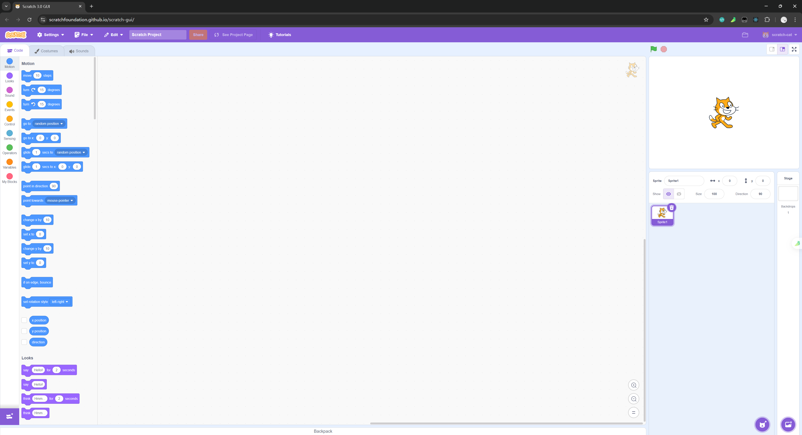

> Scratch 学习笔记。

# 🔗 参考资料

- scratch for developers：https://scratch.mit.edu/developers
- scratch-gui wiki：https://github.com/scratchfoundation/scratch-gui/wiki
- scratch-gui preview：https://scratchfoundation.github.io/scratch-gui/，查看 scratch-gui  成功启动后的默认页面样式。

- scratch-blocks wiki：https://github.com/scratchfoundation/scratch-blocks/wiki